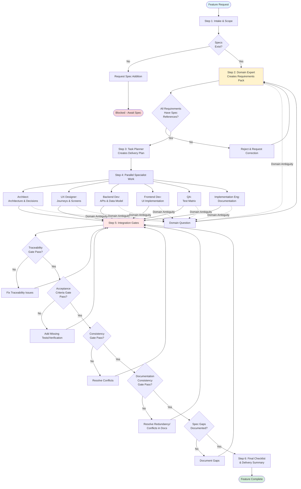

# Development Process Orchestration

## Overview

This document outlines how feature development is orchestrated across our specialized team. The Product Owner coordinates work across multiple specialist agents to ensure requirements are met, quality is maintained, and all work is traceable to specifications.

## Team Structure

Our development team consists of specialized roles:

- **Product Owner (Orchestrator)** - Coordinates workflow and ensures acceptance criteria are met
- **Domain Expert** - Interprets business domain and extracts requirements from specs
- **Task Planner** - Creates delivery plans with milestones and dependencies
- **Architect** - Designs system architecture and key technical decisions
- **UX Designer** - Creates user journeys and interaction designs
- **Frontend Developer** - Implements UI and client-side logic
- **Backend Developer** - Implements APIs, business logic, and data persistence
- **Quality Assurance** - Creates test matrices and verification strategies
- **Implementation Engineer** - Produces documentation, deployment guides, and operational notes

## Core Principles (Hard Rules)

### 1. Source of Truth: `/specs`
All requirements must be traceable to files in the `/specs` directory. No work proceeds without specification backing.

### 2. Domain Expert Authority
Only the Domain Expert can interpret business domain concepts. All other team members are domain-agnostic and must consult the Domain Expert for domain clarification.

### 3. No Invented Requirements
If a requirement cannot be supported by existing specs:
- Treat it as a **spec gap**
- Document the gap
- Request a spec update before proceeding

## Development Workflow

### Step 1: Intake and Scope

**Objective:** Understand what change is being requested

**Activities:**
- Identify the target outcome
- List relevant spec files from `/specs` that apply
- If no specs exist, stop and request spec addition

**Output:**
- Clear statement of what needs to be built
- List of applicable spec references

---

### Step 2: Requirements Pack (Domain Expert)

**Objective:** Extract and document requirements from specifications

**Activities:**
- Domain Expert reviews relevant specs
- Extracts requirements with full traceability
- Identifies ambiguities and gaps

**Required Output Format:**
```
Requirements Pack
├── Spec Sources Used
│   └── specs/<file>#<heading>
├── Glossary
│   └── Terms and definitions (with spec references)
└── Requirements
    └── For each requirement:
        ├── ID (e.g., REQ-001)
        ├── Summary
        ├── Spec Reference (specs/<file>#<heading>)
        ├── Acceptance Criteria (testable)
        ├── Open Questions (if specs unclear)
        └── Spec Gaps (what is missing and where)
```

**Quality Gate:**
- Every requirement must have a spec reference
- Reject requirements without traceability

---

### Step 3: Delivery Plan (Task Planner)

**Objective:** Create actionable work breakdown

**Input:**
- Requirements Pack from Domain Expert

**Activities:**
- Break work into milestones
- Map work items to requirement IDs
- Identify dependencies and sequencing
- Suggest parallel work streams

**Required Output Format:**
```
Delivery Plan
├── Milestones
│   └── [Milestone name, requirements covered]
├── Work Items
│   └── [Item mapped to requirement IDs]
├── Dependencies and Sequencing
│   └── [What must happen before what]
├── Parallelization Opportunities
│   └── [What can happen simultaneously]
└── Definition of Done
    └── [Per milestone]
```

---

### Step 4: Parallel Specialist Work

**Objective:** All specialists work simultaneously with same requirements pack

Each specialist receives:
- Requirements Pack
- Delivery Plan
- Their specific scope

#### Architect

**Deliverables:**
- Architecture outline and key decisions
- Interfaces and boundaries
- Cross-cutting concerns (security, logging, etc.)
- Risks and mitigations
- **Flag any conflicts with requirements**

#### UX Designer

**Deliverables:**
- User journeys and screen flows
- Design system impacts
- Interaction patterns and states
- All tied to acceptance criteria

#### Backend Developer

**Deliverables:**
- API endpoints and contracts (mapped to requirements)
- Persistence and data model changes
- Error handling strategy
- Non-functional considerations

#### Frontend Developer

**Deliverables:**
- UI implementation plan (mapped to UX outputs and requirements)
- State management approach
- Integration points with backend

#### Quality Assurance

**Deliverables:**
- Test matrix mapping acceptance criteria to tests:
  - Unit tests
  - Integration tests
  - Frontend (UI or end-to-end) tests
- Test data requirements
- Environment needs

#### Implementation Engineer

**Deliverables:**
- Quickstart guide updates
- Install and run instructions
- Operational notes and troubleshooting
- User guide sections (mapped to requirements)

---

### Step 5: Integration Gates

**Objective:** Verify completeness before acceptance

**No work is accepted until all gates pass:**

1. **Traceability Gate**
   - Every requirement ID maps to:
     - Code changes (frontend and/or backend)
     - Tests (QA coverage)
     - Documentation (where applicable)

2. **Acceptance Criteria Gate**
   - All acceptance criteria covered by tests or explicit verification steps

3. **Consistency Gate**
   - No unresolved conflicts between UX, architecture, and implementation plans
   - Documentation consistency verified:
     - No redundant specifications between `/specs` and `/docs`
     - Design decisions documented in only one authoritative location
     - Implementation guidance in `/docs` references `/specs` (never duplicates)
     - Conflicts flagged and resolved

4. **Spec Gaps Gate**
   - All spec gaps documented
   - Routed to spec update process

---

### Step 6: Final Checklist

**Objective:** Confirm delivery and handoff

**Product Owner produces:**

```
Delivery Summary
├── Completed Requirements
│   └── [List of IDs with links to artifacts]
├── Code Changes
│   └── [Files changed, PRs created]
├── Test Coverage Summary
│   └── [Pass/fail, coverage metrics]
├── Documentation Updates
│   └── [Docs modified or created]
└── Open Items
    └── [Remaining questions or spec gaps]
```

---

## Handling Blockers

**When blocked due to domain ambiguity:**

1. Route question to Domain Expert
2. Provide:
   - Exact spec section that is unclear
   - Specific question or ambiguity
3. Domain Expert responds with either:
   - Interpretation supported by existing spec text, or
   - Proposed update to `/specs` to remove ambiguity

**No work proceeds on ambiguous requirements.**

---

## Typical Feature Flow Diagram

The following diagram illustrates how a typical feature request flows through our orchestrated process:



---

## Key Success Factors

### 1. Specification-Driven Development
Every decision traces back to `/specs`. This ensures consistency, accountability, and prevents scope creep.

### 2. Clear Role Boundaries
Each specialist focuses on their domain of expertise. The Product Owner orchestrates but does not tell specialists how to do their work.

### 3. Parallel Execution
Step 4 allows multiple specialists to work simultaneously, reducing overall cycle time while maintaining quality.

### 4. Quality Gates Before Integration
Step 5 gates prevent incomplete or inconsistent work from being accepted, reducing rework and technical debt.

### 5. Continuous Traceability
From requirements to code to tests to documentation, every artifact links back to its originating requirement and specification.

---

## FAQs

**Q: What if a requirement seems obvious and doesn't need a spec?**  
A: All requirements must be in `/specs`. If something is obvious, it should be quick to document. This maintains our single source of truth.

**Q: Can a developer suggest an improvement not in the specs?**  
A: Yes, but it must go through the spec update process first. Document it as a spec gap and route it appropriately.

**Q: What if the Domain Expert is unsure about something?**  
A: Document it as an open question or spec gap. Either clarify the spec or escalate for a spec amendment.

**Q: How do we handle urgent hotfixes?**  
A: Same process, accelerated timeline. The workflow ensures quality even under pressure. Skip steps only with explicit acknowledgment of risks.

**Q: What if specialists disagree on an approach?**  
A: The Product Owner identifies the conflict and routes it to the Domain Expert if it's domain-related, or facilitates resolution if it's technical. Requirements and specs are the tiebreaker.

---

## Conclusion

This orchestrated process ensures:
- **Traceability**: Every line of code ties to a requirement and specification
- **Quality**: Multiple gates catch issues before integration
- **Efficiency**: Parallel work streams reduce cycle time
- **Consistency**: All team members work from the same requirements pack
- **Accountability**: Clear roles and deliverables for each specialist

By following this process, we deliver features that meet specifications, pass quality gates, and are fully documented for deployment and maintenance.
